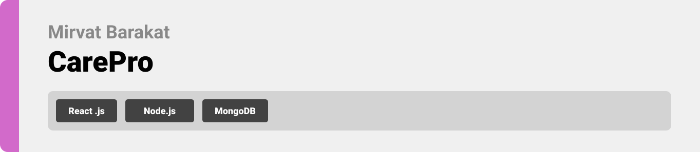
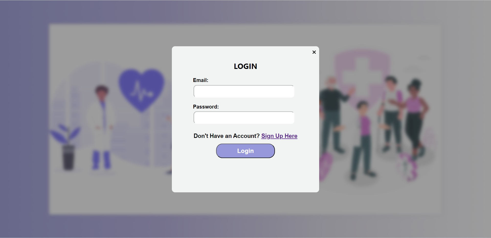
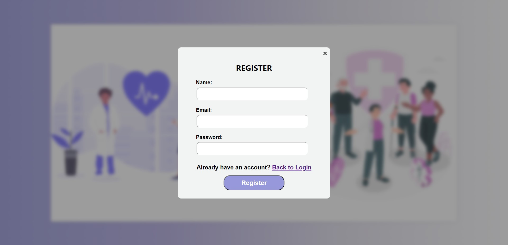
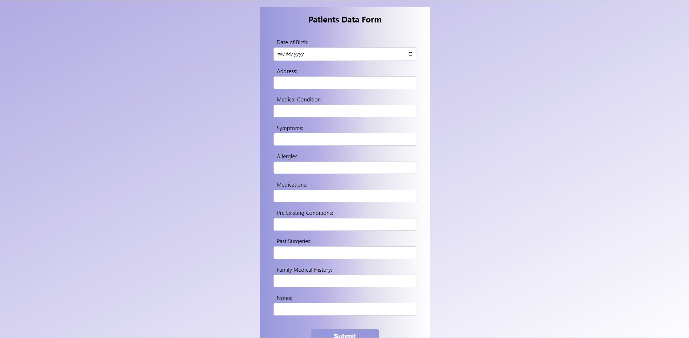
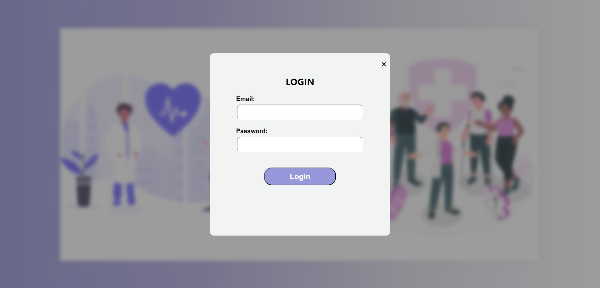
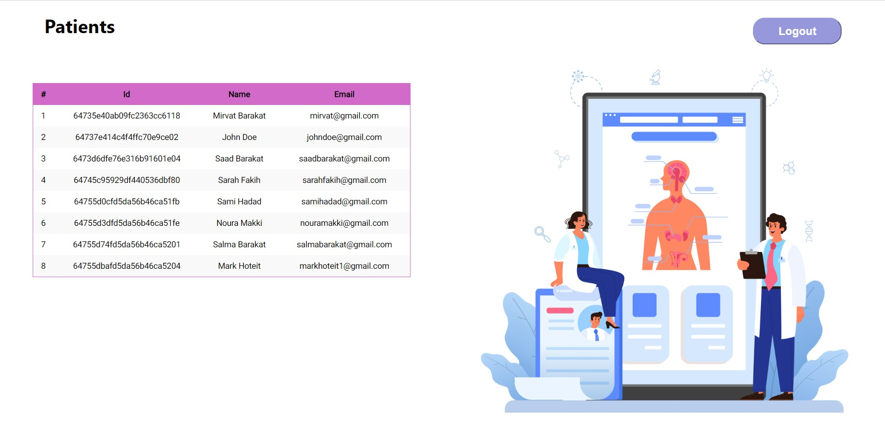
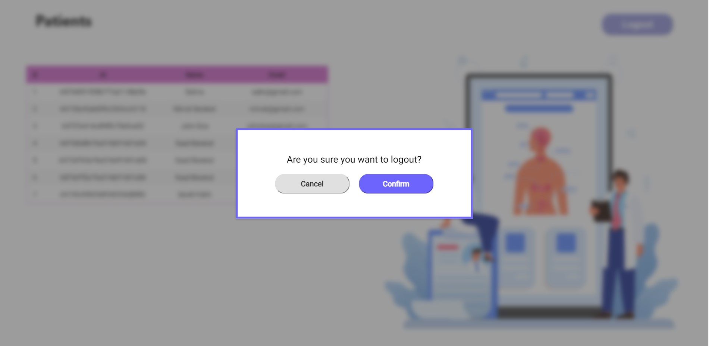

<br><br>

<!-- Implementation -->


### Patient Screens (Web)

| Login screen                                          | Users Accounts Screen                               |
| ----------------------------------------------------- | --------------------------------------------------- |
|  |  |
| View Specialists Screen                               | Add Specialist screen                               |
|  |  |
| Community Moderation Screen                           | Community Moderation Screen                         |
|  |  |

| Logout Screen  
| 

### Doctor Screens (Web)

| Login screen                                          | Users Accounts Screen                               |
| ----------------------------------------------------- | --------------------------------------------------- |
|  |  |
| View Specialists Screen                               | Add Specialist screen                               |
|  |  |
| Community Moderation Screen                           | Community Moderation Screen                         |
|  |  |

| Logout Screen  
| 

<br><br>

<!-- How to run -->


> To set up CarePro locally, follow these steps:

### Prerequisites

- Install NPM from: [NPM](https://nodejs.org/en/download)

- Install composer from: [Composer](https://getcomposer.org/download)

- Database server: Any Apache HTTP Server, MariaDB database server, recommended [XAMPP](https://www.apachefriends.org)

### Installation

2. Clone the repo
   ```sh
   git clone https://https://github.com/mirvat-brkt/AIssist
   ```
3. Install NPM packages
   ```sh
   npm install
   ```

### CarePro Backend

In `backend`:
In The Terminal Run

```sh
  nodemon .
```

### CarePro frontend

In `frontend` :

In The Terminal Run

```sh
  npm start
```

<br>
