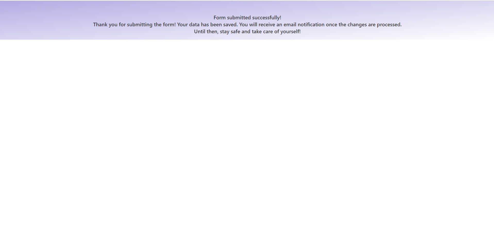

<br><br>

<!-- Implementation -->


### Patient Screens (Web)

| Get Started screen                                       | Landing Screen                                         |
| -------------------------------------------------------- | ------------------------------------------------------ |
|        |       |
| Patient Login Screen                                     | Patient Register screen                                |
|     |  |
| Patients Add Data Screen                                 | Community Moderation Screen                            |
|  |       |

| Logout Screen  
| 

### Doctor Screens (Web)

| Doctor Login screen                                        | View Patients Screen                                       |
| ---------------------------------------------------------- | ---------------------------------------------------------- |
|        |  |
| View Patient Profile                                       | Doctor Logout Screen                                       |
|  |         |

<br><br>

<!-- How to run -->


> To set up CarePro locally, follow these steps:

### Installation

Clone the repo

```sh
git clone https://https://github.com/mirvat-barakat/CarePro
```

### CarePro Backend

In `backend`:
In The Terminal Run:

```sh
  npm install
```

```sh
  nodemon .
```

### CarePro frontend

In `frontend` :

In The Terminal Run:

```sh
  npm install
```

```sh
  npm start
```

<br>
